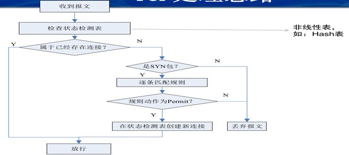
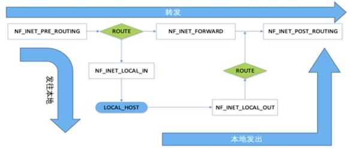
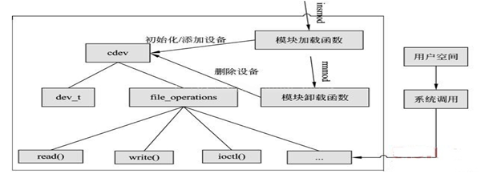
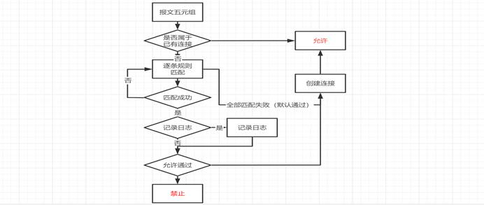
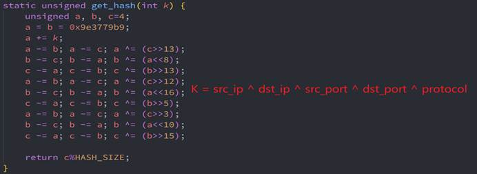
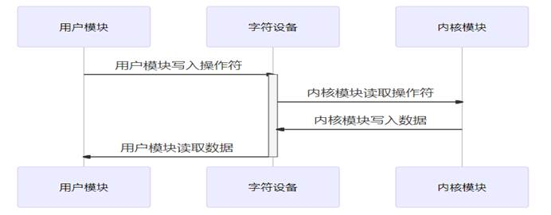
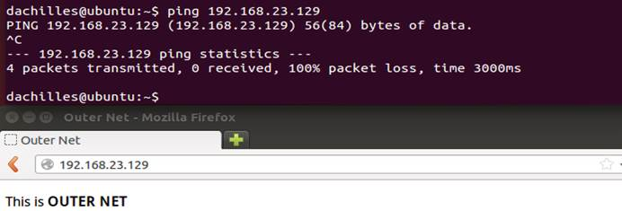
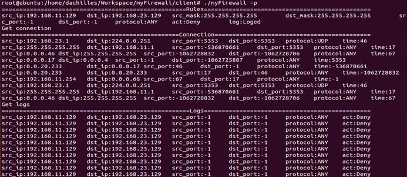

# Linux下状态检测防火墙的设计与实现

## 0x00 简介

本实验为2021年华中科技大学网络空间安全学院《网络安全课程设计》的实验，要求实现一个带NAT功能的状态检测防火墙（NAT我没有实现）。这份课设本来就有参考之前的学长学姐的代码，虽然我写的很垃但还是贡献出来，送给想划水的同学，希望能帮到你，也希望你写好之后也能上传分享给以后的学弟学妹 :)

## 0x01 实验目的和要求

**实验目的**

- 结合理论课程学习，深入理解计算机网络安全的基本 原理与协议，巩固计算机网络安全基本理论知识

- 熟练掌握计算机网络编程方法，拓展学生的应用能力

- 加强对网络协议栈的理解

- 提高分析、设计软件系统以及编写文档的能力

- 培养团队合作能力。

**实验要求**

- 正确理解题意

- 具有良好的编程规范和适当的注释

- 有详细的文档，文档中应包括设计题目涉及的基础知识、 设计思路、程序流程图、程序清单、开发中遇到的问题及解决方法、设计中待解决的问题及改进方向

**任务要求：**

1. 系统运行
   - 系统启动以后插入模块，防火墙以内核模块方式运行
   - 应用程序读取配置，向内核写入规则，报文到达，按照规则进行处理
2. 界面
   - 采用图形或者命令行方式进行规则配置，界面友好
3. 功能要求
   - 能对TCP、UDP、ICMP协议的报文进行状态分析和过滤
   - 每一条过滤规则至少包含：报文的源IP(带掩码的网络地址）、目的IP(带掩码的网络地址）、源端口、目的端口、 协议、动作（禁止/允许），是否记录日志
   - 过滤规则可以进行添加、删除、保存，配置的规则能立即生效
   - 过滤日志可以查看
   - 具有NAT功能，转换地址分按接口地址转换和指定地址转 换（能实现源或者目的地址转换的任一种即可）
   - 能查看所有连接状态信息
4. 测试

   - 测试系统是否符合设计要求
   - 系统运行稳定
   - 性能分析

## 0x02 实验原理

### 状态检测技术

状态检测技术是防火墙近几年才应用的新技术。传统的包过滤防火墙只是通过检测IP包头的相关信息来决定数据流的通过还是拒绝，而状态检测技术采用的是一种基于连接的状态检测机制，将属于同一连接的所有包作为一个整体的数据流看待，构成连接状态表，通过规则表与状态表的共同配合，对表中的各个连接状态因素加以识别。这些状态信息可由状态检测表存储，状态检测表包括所有通过防火墙的连接，并维护所有连接。每条连接的信息包括源地址、目的地址、协议类型、协议相关信息（如TCP/UDP协议的端口、ICMP协议的ID号）、连接状态(如TCP连接状态)和超时时间(若进行NAT转换，还需记录转换前后地址端口信息)等。这里动态连接状态表中的记录可以是以前的通信信息，也可以是其他相关应用程序的信息，因此，与传统包过滤防火墙的静态过滤规则表相比，它具有更好的灵活性和安全性。

对于TCP连接，一次连接以3次握手开始，以4次挥手或Reset报文结束。由于TCP协议是询问-应答类型的可靠数据传输协议，故TCP连接存在状态，对于同一连接的报文，只需对其握手报文进行规则匹配即可，若允许通过，则同一TCP连接的所有报文均可通过，无需遍历规则表。

对于非TCP连接，防火墙为其建立虚拟连接。

UDP：一方发出UDP包后，如DNS请求，防火墙会将从目的地址和端口返回的、到达源地址源端口的包作为状态相关的包而允许通过。

ICMP：信息查询报文，如ping(echo)包，其状态相关包就是来自目的地址的echo reply包，而没有与echo包对应的echo reply包则认为是状态非法的。

### Linux Netfilter架构

Netfilter 是 Linux 内核中进行数据包过滤，连接跟踪（Connect Track），网络地址转换（NAT）等功能的主要实现框架；该框架在网络协议栈处理数据包的关键流程中定义了一系列钩子点（Hook 点），并在这些钩子点中注册一系列函数对数据包进行处理。这些注册在钩子点的函数即为设置在网络协议栈内的数据包通行策略，也就意味着，这些函数可以决定内核是接受还是丢弃某个数据包，换句话说，这些函数的处理结果决定了这些网络数据包的“命运”。

Netfilter框架在网络协议各层的各个hook点如下图所示。

### Linux字符设备驱动

字符设备：是指只能一个字节一个字节进行读写操作的设备，不能随机读取设备中的某一数据、读取数据要按照先后数据。字符设备是面向流的设备，常见的字符设备有鼠标、键盘、串口、控制台和LED等。

字符设备可以通过文件节点来访问，比如/dev/tty1和/dev/lp0等。这些设备文件和普通文件之间的唯一差别在于对普通文件的访问可以前后移动访问位置，而大多数字符设备是一个只能顺序访问的数据通道。然而，也存在具有数据区特性的字符设备，访问它们时可前后移动访问位置。例如framebuffer就是这样的一个设备，app可以用mmap或lseek访问抓取的整个图像。

如图，在Linux内核代码中：

- 使用struct cdev结构体来抽象一个字符设备；
- 通过一个dev_t类型的设备号（分为主（major）、次设备号（minor））一确定字符设备唯一性；
- 通过struct file_operations类型的操作方法集来定义字符设备提供个VFS的接口函数。

## 0x03 实验环境和采用的工具

操作系统：Ubuntu14.04

内核版本：Linux 4.4.0-142-generic

编译环境：gcc version 4.8.4 (Ubuntu 4.8.4-2ubuntu1~14.04.4)

## 0x04 系统设计

### 系统静态结构设计

- 内核模块设计

  内核模块由访问控制处理逻辑和字符设备驱动构成。访问控制处理逻辑负责对报文进行过滤分析，实现状态监测；字符设备驱动负责内核态与用户态的交互。

  访问控制处理逻辑维护了规则表、日志表、HASH表与连接链、NAT表。其中，规则表负责记录规则信息，包括七元组（五元组+IP掩码）、动作、以及是否记录日志等；日志表负责记录规则与连接信息；HASH表与连接链共同维护连接信息，包括连接双方的网络信息、剩余超时时间等；NAT表负责维护NAT地址转换。

  hook_in和hook_out两个Hook函数维护了连接链和HASH表。通过查询规则表的访问控制规则决定是否允许报文通过，同时更新连接链和Hash表的状态信息，并且对匹配的规则记录日志。

  字符设备驱动部分通过对字符设备的操作实现内核模块与用户模块的信息传递。其中，.read操作负责根据操作码，将内核模块所维护的连接信息、日志信息以及NAT信息发送给字符设备供用户模块读取；.write操作负责从字符设备读取操作码，实现规则载入以及调用.read实现信息输出。

- 用户模块设计

  用户模块由C++实现，完成了规则的维护（包括存储、读取、新增、删除、以及载入到内核）、连接信息的获取、日志获取。

  用户模块项目结构如下所示，将内核模块的5个重要数据结构抽象成类。

  内核模块的规则信息在用户模块抽象成Rule类。主要实现新规则的构造、规则信息的格式转换，以及规则展示。

  内核模块的日志信息在用户模块抽象成Log类。主要实现五元组信息的记录以及日志信息的展示。

  内核模块的HASH表与连接链在用户模块共同抽象成Connection类。主要记录了连接状态信息，除五元组外还包含连接剩余时间。

  内核模块的NAT信息在用户模块抽象成NAT类。主要实现NAT信息的记录、修改与展示。

  除了规则Rule类之外，剩余三个类都是直接与内核模块进行信息交互，信息流通方向主要是从内核模块到用户模块单向流通。但Rule信息采用了本地存储-远程提交的方法，通过在用户模块建立本地数据库对规则进行增、删、查、改的统一管理，再通过commit操做将整个规则表发送给内核模块，有效的减少了不必要的信息流动，增加了系统工作效率。

### 系统核心数据流程

hook_in与hook_out两个hook函数获取到流量包后，统一交付给check_pkg函数处理。check_pkg函数首先根据流量包的五元组信息检查该流量包是否属于已经建立的连接。若属于，则直接放行，并更新所属连接的存活时间；否则，将根据流量包的类型（TCP/UDP/ICMP/其它）以及规则表来确定是创建新连接还是拒绝流量包通过。

## 0x05 系统详细设计

### 关键数据结构设计

- 内核模块数据结构

  1. 规则表

     规则表为struct rule结构体的数组，同时通过static int 类型的rule_num变量来维护规则表的大小。

     struct rule结构体定义如下：

     | **类型** | **变量** | **描述**                     |
     | -------- | -------- | ---------------------------- |
     | unsigned | src_ip   | 源IP                         |
     | unsigned | dst_ip   | 目的IP                       |
     | unsigned | src_mask | 源IP掩码                     |
     | unsigned | dst_mask | 目的IP掩码                   |
     | int      | src_port | 源端口                       |
     | int      | dst_port | 目的端口                     |
     | int      | protocol | 协议号                       |
     | int      | action   | 动作（0丢弃，1通过）         |
     | int      | log      | 是否记录日志（0忽略，1记录） |

  2. 日志表

     日志表为struct log结构体的数组，同时通过static int 类型的log_num变量来维护日志表的大小。

     struct log结构体定义如下：

     | **类型** | **变量** | **描述**             |
     | -------- | -------- | -------------------- |
     | unsigned | src_ip   | 源IP                 |
     | unsigned | dst_ip   | 目的IP               |
     | int      | src_port | 源端口               |
     | int      | dst_port | 目的端口             |
     | int      | protocol | 协议号               |
     | int      | action   | 动作（0丢弃，1通过） |
  
  3. 连接链与HASH表

     连接链为struct connection结构体的链表，表头结点为空结点conHead。每个结点包括该连接的基本五元组信息以及一个用于定位到HASH表的索引字段。
  
     struct connection结构体定义如下：

     | **类型**            | **变量** | **描述**       |
     | ------------------- | -------- | -------------- |
     | unsigned            | src_ip   | 源IP           |
     | unsigned            | dst_ip   | 目的IP         |
     | int                 | src_port | 源端口         |
     | int                 | dst_port | 目的端口       |
     | int                 | protocol | 协议号         |
     | int                 | index    | HASH索引       |
     | struct  connection\* | next     | 下一个连接结点 |
  
     HASH表为一个字符数组，记录了连接链中每个连接的剩余存活时间。为了实现HASH表的功能，设计了一个HASH函数，将每个连接的五元组信息作为HASH函数的关键字映射到HASH表中。
  
     连接链与HASH表的映射关系如下图所示：

  

- 用户模块数据结构

  1. Rule类

     Rule类对应内核模块的规则表，提供对规则信息提取与操做多个接口。

     | 变量     | 类型     | 描述         |
     | -------- | -------- | ------------ |
     | src_ip   | unsigned | 源IP         |
     | dst_ip   | unsigned | 目的IP       |
     | src_mark | unsigned | 源IP掩码     |
     | dst_mark | unsigned | 目的IP掩码   |
     | src_port | int      | 源端口       |
     | dst_port | int      | 目的端口     |
     | protocol | int      | 协议号       |
     | action   | int      | 是否通过     |
     | log      | int      | 是否记录日志 |

     | 方法                         | 返回值   | 描述                                                     |
     | ---------------------------- | -------- | --------------------------------------------------------- |
     | Rule()                       | 构造函数 | 创建一个新的Rule对象                                      |
      | Rule(char* data, int offset) | 构造函数 | 创建一个新的Rule对象(从data指向地址+offset偏移处获取数据) |
      | srcIP(std::string ip_str)    | void     | 将对象的src_ip修改为ip_str所指向的IP                      |
      | dstIP(std::string ip_str)    | void     | 将对象的dst_ip修改为ip_str所指向的IP                      |
      | srcMask(std::string ip_str)  | void     | 将对象的src_mask修改为ip_str所指向的掩码                  |
      | dstMask(std::string ip_str)  | void     | 将对象的dst_mask修改为ip_str所指向的掩码                  |
      | print()                      | void     | 将对象按标准格式打印                                      |
  
  2. Log类
  
     Log类对应内核模块的日志表，提供对日志信息提取与操做多个接口。
  
     | 变量     | 类型     | 描述     |
     | -------- | -------- | -------- |
     | src_ip   | unsigned | 源IP     |
     | dst_ip   | unsigned | 目的IP   |
     | src_port | int      | 源端口   |
     | dst_port | int      | 目的端口 |
     | protocol | int      | 协议号   |
     | action   | int      | 是否通过 |
  
     | 方法                        | 返回值   | 描述                                                     |
     | --------------------------- | -------- | -------------------------------------------------------- |
     | Log(char *data, int offset) | 构造函数 | 创建一个新的Log对象(从data指向地址+offset偏移处获取数据) |
     | print()                     | void     | 将对象按标准格式打印                                     |
  
  3. Connection类
  
     Connection类对应内核模块的连接表，提供对连接信息提取与操做多个接口。
  
     | 变量     | 类型     | 描述         |
     | -------- | -------- | ------------ |
     | src_ip   | unsigned | 源IP         |
     | dst_ip   | unsigned | 目的IP       |
     | src_port | int      | 源端口       |
     | dst_port | int      | 目的端口     |
     | protocol | int      | 协议号       |
     | time     | int      | 剩余存活时间 |

     | 方法                               | 返回值   | 描述                                                         |
     | ---------------------------------- | -------- | ------------------------------------------------------------ |
     | Connection(char *data, int offset) | 构造函数 | 创建一个新的Connection对象(从data指向地址+offset偏移处获取数据) |
     | print()                            | void     | 将对象按标准格式打印                                         |
  
  4. 其它功能函数
  
     | 返回值   | 函数                              | 描述                                                      |
     | -------- | --------------------------------- | --------------------------------------------------------- |
     | unsigned | strToIp(std::string ip_str)       | 将string类型的ip转换为unsigned类型                        |
     | string   | ipToStr(unsigned ip)              | 将unsigned类型的ip转换为string类型                        |
     | int      | strToPtc(std::string ptc_str)     | 将string类型的ptc(协议名)转换为int类型(协议号)            |
     | string   | ptcToStr(int ptc)                 | 将int类型的ptc(协议号)转换为string类型(协议名)            |
     | unsigned | byteToInt(char *byte, int offset) | 将byte指向地址+offset偏移出的字节数据转换为int类型        |
     | string   | toAct(int x)                      | 将int类型的action转换为string类型(0-> “Deny”, 1->“Accept” |
     | string   | toLog(int x)                      | 将int类型的log转换为string类型(1->“Loged”, 0->“Unloged”   |

### 关键模块流程设计

- 内核模块流程

  1. 报文过滤

     报文过滤是本次防火墙实验主要需要实现的功能。内核模块中，对于NF_INET_PRE_ROUTING和NF_INET_POST_ROUTING两个hook点分别设置了hook_in与hook_out函数。两个hook函数实际上均是调用名为check_pkg的函数对经过hook点的报文进行判断是否允许通过。

     在check_pkg函数中，首先提取出报文的五元组信息并判断是否属于已有连接的报文（详见下一节：**状态检测**）。如果属于已有连接则直接放行，否则将报文的五元组信息与规则表中存储的规则逐条匹配来决定能否通过。如果是允许通过的报文，则在连接链与HASH表中创建一个新的连接信息，以便后续的检测使用。

     报文过滤流程图如下所示：

     

  2. 状态检测

     与普通的包过滤防火墙不同，状态检测防火墙主要基于连接来判断是否允许一个报文通过。

     为了建立报文与连接的映射，将报文的五元组（源IP，目的IP，源端口，目标端口，协议号）一起作为HASH函数的关键字进行哈希，计算出的HASH值即当前报文对应连接在HASH表中的位置。

     HASH表记录了当前连接的剩余存活时间。如果剩余存活时间为0，说明当前报文未创建连接或连接已超时，内核模块将根据规则表来决定是否为其创建连接；如果剩余时间不为0，说明已经为当前报文创建连接，直接将报文放行并更新剩余时间。

     HASH函数如下所示：

     

  3. 时间控制

     为了防止资源被占用，需要将连接链中长期没有数据流通的连接删除。Linux内核中提供了一个定时器的功能用于处理周期性工作，我们将使用这个功能来实现时间控制功能。

     创建一个struct timer_list定时器并绑定到time_out函数。当定时器发生超时时，将会调用time_out函数。

     在time_out函数中，我们将遍历整条连接链，将所有连接的剩余时间减1。当某个连接的剩余时间被减为0时，表明该链接已经超时，此时将会将该连接结点释放并继续遍历。

     定时器的超时时间为1秒；连接被创建时初始剩余时间为60。因此当某个连接超过1分钟没有进行数据传输时即会被断开。

  4. 字符设备驱动

     为了让内核模块与用户模块进行数据的交互，系统采用字符设备的方法实现了内核模块和用户模块的信息交互。

     为了区分传递信息的流向与内容，内核模块维护了一个全局操作符变量，并定义了3个操作符：

     | 操作符         | 值   | 含义                         |
     | -------------- | ---- | ---------------------------- |
     | OP_WRITE_RULR  | 0    | 内核模块从用户模块取规则信息 |
     | OP_GET_CONNECT | 1    | 用户模块从内核模块取连接信息 |
     | OP_GET_LOG     | 2    | 用户模块从内核模块取日志信息 |

     每次进行数据交互时，规定总是首先由用户模块向内核模块写入数据，且写入数据的最后一个字节为上述操作符之一。

     当用户模块写入数据时，判断其操作符。操作符为OP_WRITE_RULR时，内核模块将读取用户模块写入的所有数据，并将数据逐条存入内核模块的规则表中；当操作符为OP_GET_CONNECT或OP_GET_LOG时，内核模块将更新其维护的全局操作符为对应的值；

     当用户模块读取数据时，由于在上一步的写入操作符过程中更新了其全局操作符，内核模块将根据全局操作符的值来决定是将日志信息还是连接信息写入字符设备，再由用户模块读取。

     数据传输流程如下图所示：

     

- 用户模块流程

  用户模块用C++实现。

  ​    程序运行时，将根据其传入的参数决定功能。具体功能如下图所示：

  ​        

  1. 规则的增删查改

     用户模块最重要的功能在于规则的维护，包括输出规则、新建规则与删除规则。

     不同于日志信息与连接信息主要由内核模块维护，规则信息采取了“本地存储+远程推送”的模式，即：规则的存储、新增、查询、删除都是在本地数据库中进行操作，内核模块只能单向地接受来自用户模块所提交的规则，而不能将规则信息输出到用户模块。这样既能保证每次机器重启时都能保存之前所创建的规则表，又减少了内核模块与用户模块之间频繁的数据传输，增加了系统执行效率。

     对于新建规则，程序将根据用户输入信息创建一个新的Rule类型的对象，并通过文件读写操作将其保存在本地数据库；对于删除规则，程序将根据索引值在本地数据库中删除对应规则的信息；对于查询规则，程序将把本地数据库中所存储的规则添加到用户模块所维护的规则表中。

     当本地规则维护完毕之后，用户可使用 `-c/--commit` 参数将规则提交到内核模块。此时，用户模块首先将本地数据库中的规则信息全部加载到用户模块所维护的规则表中。之后用户模块向内核模块所创建的字符设备输入OP_WRITE_RULR操作符，并将用户模块所存储的规则表全部输入到字符设备；内核模块收到OP_WRITE_RULR操作符时，将会开始接受字符设备中的规则表，实现了规则表从用户模块向规则模块的流通。

     

  2. 日志信息打印

     当使用 `-p l/log` 命令时，程序将打印当前存储的日志信息。

     当使用 `-p l/log` 命令时，用户模块将会向内核模块所创建的字符设备输入OP_GET_LOG操作符。内核模块收到操作符时，会把其所维护的日志信息输出到字符设备中，用户模块再读取字符设备中所获得的日志信息加载到其所维护的日志表中并打印到屏幕上。

     

  3. 连接信息打印

     当使用 `-p c/connection` 命令时，程序将打印当前存储的日志信息。

     当使用 `-p c/connection` 命令时，用户模块将会向内核模块所创建的字符设备输入OP_GET_CONNECT 操作符。内核模块收到操作符时，会把其所维护的连接信息输出到字符设备中，用户模块再读取字符设备中所获得的连接信息加载到其所维护的连接表中并打印到屏幕上。

     

## 0x06 系统测试

### 测试环境

内网网段为192.168.11.0/24，外网网段为192.168.23.0/24。部署三台虚拟机，分别模拟内网主机、外网主机与防火墙。其中内网主机IP为192.168.11.129，外网主机IP为192.168.23.129，防火墙同时连接内外网负责转发，IP为192.168.11.128（内网）、192.168.23.128（外网）

### 功能测试

- 连通性测试

  在不开启防火墙的情况下，在外网主机上开启apache服务，此时，在浏览器中输入外网IP（访问其80端口），可以访问其主页；ping外网主机IP也能ping通

  

- 添加规则

  使用-a命令为防火墙添加以下两条规则：

  | **src_ip**     | **dst_ip**     | **src_mark** | **dst_mark** | **src_port** | **dst_port** | **ptc** | **act** | **log** |
  | -------------- | -------------- | ------------ | ------------ | ------------ | ------------ | ------- | ------- | ------- |
  | 192.168.11.129 | 192.168.23.129 | 32           | 32           | -1           | 80           | TCP     | 1       | 1       |
  | 192.168.11.129 | 192.168.23.129 | 32           | 32           | -1           | -1           | ANY     | 0       | 1       |

  

  上述两条规则中，规则1允许内网主机使用TCP协议访问外网主机的80端口，规则2禁止内网主机对外网主机的任何访问。将规则添加之后可以看见本地数据库中已经保存了这两条规则。

- 规则测试

  添加上述两台规则之后，使用 -c命令将规则commit到内核模块中。此时，内网主机依旧能访问外网主机的网页，但已经无法ping通外网主机。

  

  之后，将规则1删除，再次进行上述测试。可以发现此时内网主机既无法访问外网主机的HTTP服务，也无法ping通外网主机

  

- 信息获取

  使用-p参数获取当前的日志信息与连接信息，可以发现系统能够正确记录连接与日志。

  

## 0x07 心得体会及意见建议

本次实验是大学阶段最后一个课程设计，要求实现了一个状态检测防火墙，实现了基于连接的检测，不需要对每个数据包进行规则检查，而是一个连接的后续数据包（通常是大量的数据包）通过散列（hash) 算法，直接进行状态检查，从而使得性能得到了较大。

在实验过程中，遇到的第一个问题是对Netfilter框架没有了解，不知道从何下手，还好在查阅了大量资料之后掌握了Netfilter和钩子函数的基本用法。

由于系统同时包含内核模块与用户模块，虽然之前接触过Linux系统编程，但由于间隔时间过长，再加上内核编程与普通应用程序开发确实有比较大的差别，在开始的时候走了不少弯路。不过在编写字符设备驱动时，由于以前有相关方面的经验，这一部分的代码写的比较顺利。

另外一个特点是在内核模块中维护连接表。内核模块中日志与规则的管理都能简单地用数组实现，但是由于连接信息需要频繁地动态修改，不能采用之前地数据结构来存储连接信息。在和同学进行细致的讨论之后，决定采用链表与HASH表结合的方法，将每个连接作为一个链表结点，同时将连接的剩余时间存放在HASH表中，这样既保证了Hash的快速访问，又支持超时连接的删除。

对于连接的时间控制上也遇到了一些小麻烦。由于对Linux内核定时器机制不了解，不知道执行完定时中断函数后操作系统会将定时处理函数从事务处理链表中摘下，查阅相关资料后修改了中断函数的代码，在执行完中断逻辑后再次将定时器加到事务处理链表中。

由于内核编程常常会涉及到整个操作系统，特别是内核态与用户态的交互，实验过程中每一个新功能的尝试都可能导致虚拟的奔溃死机。而且内核编程不像普通应用程序开发一样有强大的现代工具作为辅助，常常是几个小时都找不到问题所在，这点我在编写内核模块之后编写用户模块有深刻的体会。这也告诉我们，尽管现在编程工具越来越强大，但只有加强自身能力，编写规范的代码，才能在任何情况下写出一个满意的程序，成为一名优秀的计算机工作者。
